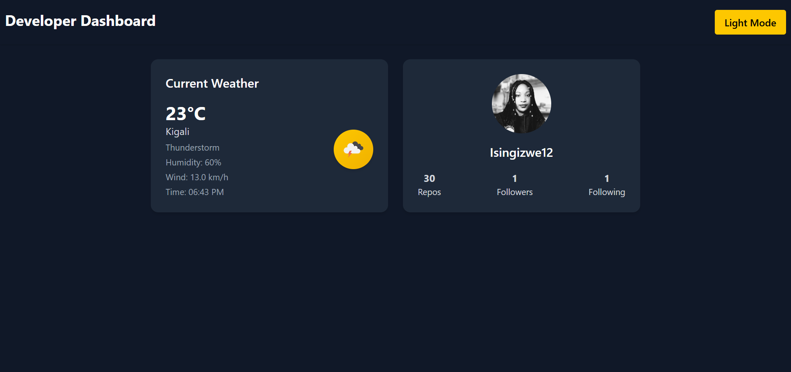

# Developer Dashboard

A simple and responsive developer dashboard built with **React** and **Tailwind CSS** that shows your **current weather** and **GitHub user info**. The dashboard supports **dark/light mode** and automatically adapts to different screen sizes.

---

## Features

- Weather card showing:
  - Temperature
  - Weather conditions
  - Humidity
  - Wind speed
  - Local system time
- GitHub card showing:
  - User avatar
  - Username
  - Number of repositories, followers, and following
- Dark/Light mode toggle
- Responsive layout (mobile and desktop friendly)

---

## Technologies

- **Frontend**: React, Tailwind CSS
- **State management**: useState, useEffect
- **APIs**:
  - [OpenWeatherMap API](https://openweathermap.org/api)
  - [GitHub REST API](https://docs.github.com/en/rest)

---

## Installation

1. **Clone the repository**

git clone https://github.com/Isingizwe12/Developer_dashboard
cd developer_dashboard 

### Install dependencies
***npm install***

### Run the project

***npm run dev***

### Environment Variables
-Get your OpenWeatherMap API key from OpenWeatherMap
 and add it in WeatherCard.jsx: 

 const API_KEY = "YOUR_API_KEY";

 GitHub username can be updated in GitHubCard.jsx:

 const username = "YOUR_GITHUB_USERNAME";

 ## The image preview of a simple design

